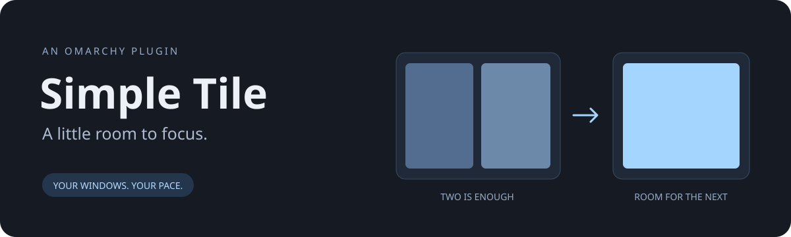

# Simple Tile



**Choose a window limit. Let the next workspace take the overflow.**

Simple Tile is a small Omarchy bar plugin for people who like tiled windows
without squeezing everything onto one workspace. With a limit of **2**, your
first two windows stay together; the third moves to the next workspace with room.

- **1–8 windows** per workspace, selectable from the bar.
- **Pause anytime** with a right-click. Existing windows stay put.
- **Follow the window**, or keep working on your current workspace.
- **Native Omarchy styling** that follows your desktop theme.
- **Event-driven:** no background Python daemon, tray service, or idle polling.
- **Python standard library only.** No pip packages or PyGObject required.

## Install

Requires **Omarchy with the Quickshell plugin system**, Python 3.10+, and
**Hyprland 0.56.2 with its Lua dispatch API**. Older Waybar-based Omarchy
installations are not supported. This is an early `0.1.0` release.

```sh
omarchy plugin add https://github.com/uBruckhaus/omarchy-simple-tile.git
omarchy plugin enable ubruckhaus.simple-tile
```

The widget appears on the right of the bar. Click **▦ 2** to open settings.
Right-click to pause or resume. In the popup, use Tab to navigate controls,
Enter or Space to activate them, and Escape to close.

```sh
omarchy bar move ubruckhaus.simple-tile --section right
omarchy plugin disable ubruckhaus.simple-tile
omarchy plugin remove ubruckhaus.simple-tile
```

## How overflow works

Only newly opened, mapped, visible tiling windows trigger a move. Floating
windows, fullscreen windows, scratchpads, and newly opened tab-group members
are left alone. Existing windows are never rearranged when you change the limit
or resume the plugin. Manually moving windows does not trigger enforcement.

Simple Tile scans higher-numbered workspaces on the source monitor for room.
If those are full, it chooses a new number after that monitor's highest workspace,
skipping IDs already used on other monitors. It targets the new window by address,
so changing focus cannot cause a different window to be moved.

Hyprland remains responsible for creating new workspaces and applying your
workspace rules, including explicit monitor assignments. Named and special
workspaces are excluded. The limit counts visible tiled clients, not layout
slots; tabbed/grouped layouts are deliberately not automatically redistributed.

## Settings

Settings live inline in `~/.config/omarchy/shell.json`, on the widget's bar entry:

```json
{
  "id": "ubruckhaus.simple-tile",
  "active": true,
  "maxWindows": 2,
  "follow": true
}
```

Use the popup to change them. Omarchy saves the settings and shares them across
monitors. Pausing keeps the control visible; disabling the plugin removes it.
The prototype's separate `simple-tile/config.json` is no longer used.

## Development

```sh
python3 -m unittest discover -s tests -v
omarchy plugin validate .
```

`BarWidget.qml` owns the interface and subscribes to Quickshell's Hyprland
`openwindow` events. A short-lived Python helper reads the saved settings,
queries clients/workspaces, and moves only the overflowing window. Calls are
serialized with a runtime file lock, including calls from multiple bar instances.
The helper verifies that Hyprland actually moved the window before reporting success.

To inspect a decision without moving anything, supply an address from
`hyprctl clients -j`:

```sh
python3 simple_tile.py --window 0xYOUR_ADDRESS --dry-run
```

The plugin must be enabled in the bar configuration for the helper to act.
Failures show an **!** in the bar and a message in the popup; details go to the
Omarchy shell log. The helper's JSON output is also useful for debugging.

See [the prototype review](docs/REVIEW.md) for the bugs addressed and
[release checks](docs/RELEASING.md) for the remaining marketplace work.

## License

MIT © 2026 Uwe Bruckhaus
